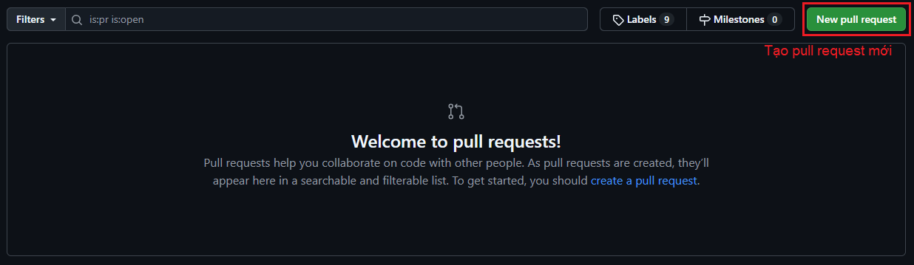
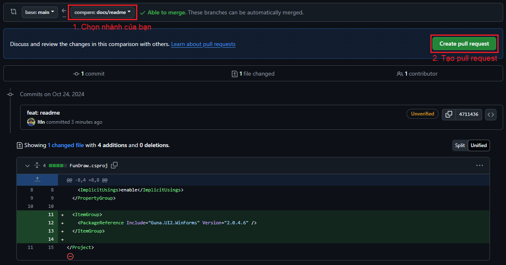
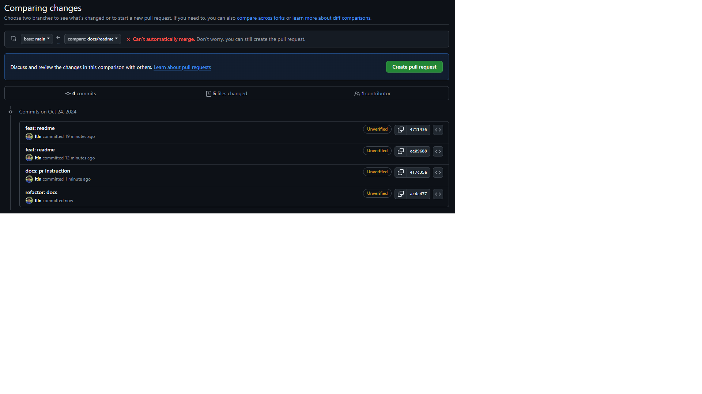
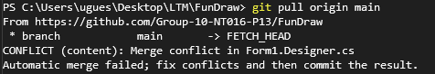
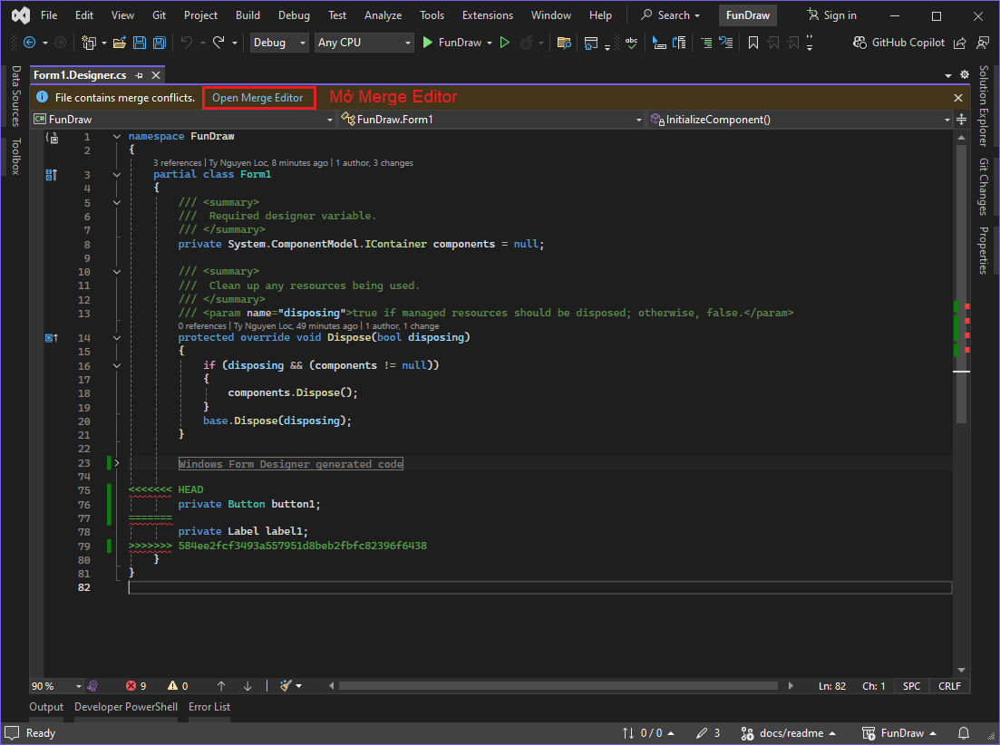
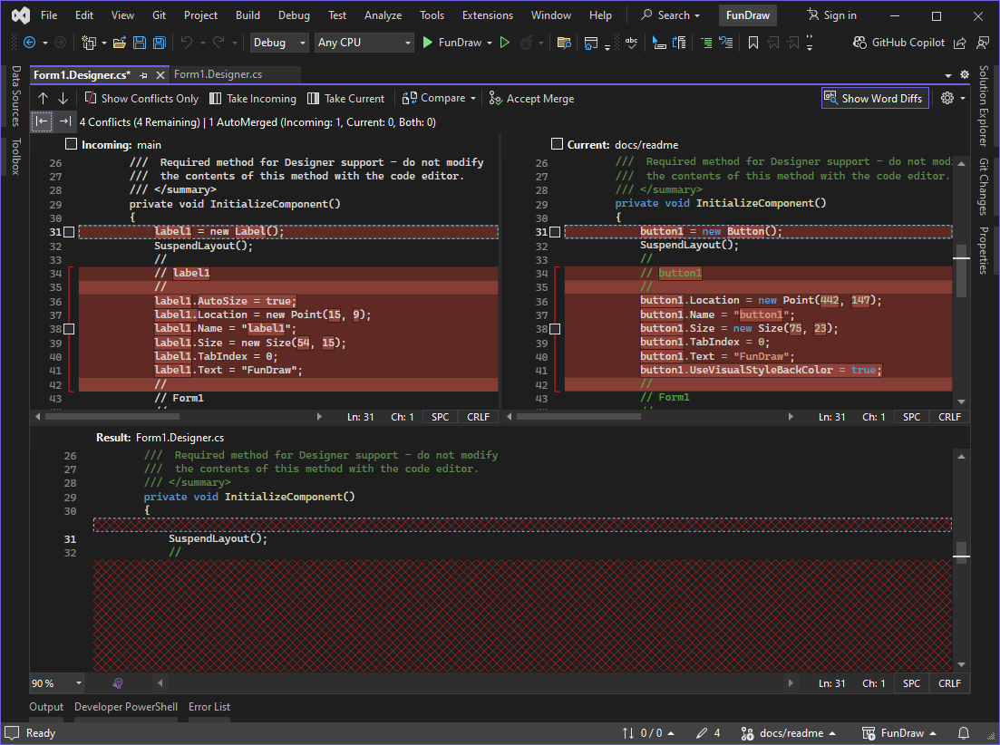
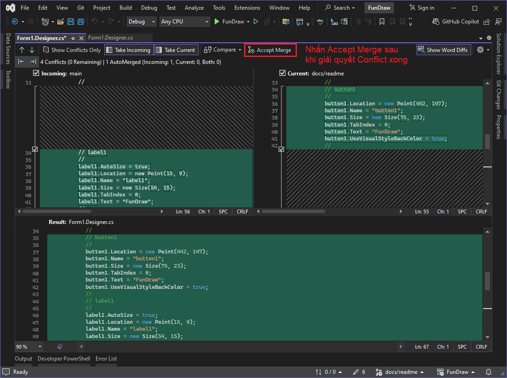

# FunDraw
Ứng dụng game vẽ và đoán hình. Đồ án môn Lập trình mạng căn bản NT106

API: https://github.com/ltln/FunDraw-API

## Bắt đầu phát triển
1. Clone repository này về
```sh
cd <your workspace>
git clone https://github.com/Group-10-NT016-P13/FunDraw.git
```
2. Cài đặt các dependencies cần thiết
```sh
dotnet tool install Husky
```
3. Tạo một nhánh phát triển mới
```sh
git checkout -b feature/new-feature
```
4. Tạo commit và đẩy lên remote
**[Lưu ý!!!](https://stellar-horn-ccf.notion.site/Git-workflow-Commit-Convention-25caac2850904fa4800ada4d60de4d36?pvs=74)**
```sh
git add .
git commit -m "feat: new feature"
git push
```
5. Tạo một pull request vào nhánh main
- Vào trang [Pull Request](https://github.com/Group-10-NT016-P13/FunDraw/pulls) và tạo Pull Request

- Chọn nhánh bạn đang phát triển và nhấn tạo Pull Request

- Nếu nhánh của bạn không thể merge như hình dưới, hãy [resolve conflict](#resolve-conflict)


### Resolve conflict
1. Quay trở lại Visual Studio, trên nhánh hiện tại bạn đang phát triển, pull main về
```
git pull origin main
```

2. Theo thông báo `CONFLICT`, tìm và mở từng file bị conflict
`CONFLICT (content): Merge conflict in Form1.Designer.cs`: Tìm file `Form1.Designer.cs`

3. Mở Merge Editor

4. Giải quyết Conflict
Tick vào ô ở bên phải code bị conflict để giữ, tick bên nào thì giữ bên đó, tick cả hai thì giữ cả hai

5. Nhấn Accept Merge sau khi giải quyết Conflict xong

6. Tiếp tục commit, push code lên remote và tạo Pull Request mới